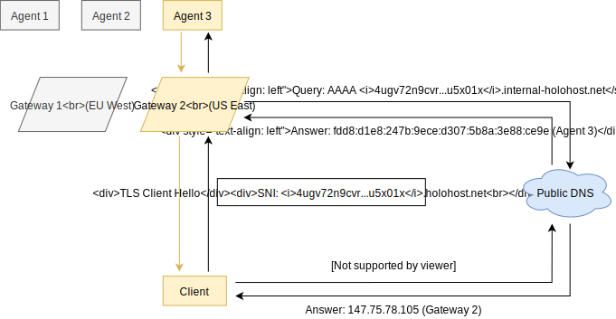

# Holo Router

## Architecture

### Gateway

Gateway dispatches unaltered TCP traffic by TLS SNI that is resolved using
system-wide DNS, which is normally set to [Registry](#registry) `GET
/v1/dns-query` passed through [dnscrypt-proxy][].

Dispatch is only allowed for hostnames that end with `.holohost.net`.

[dnscrypt-proxy]: https://github.com/DNSCrypt/dnscrypt-proxy
[letsencrypt]: https://letsencrypt.org
[wikipedia-sni]: https://en.wikipedia.org/wiki/Server_Name_Indication

### Registry

[DNS-over-HTTPS][wikipedia-dns-over-https] resolver and HTTP `POST /v1/update`
server implemented on top of [Cloudflare Workers][cloudflare-workers].

Endpoints:

- `POST /v1/update` adds Base36-encoded Holochain public key -> internal
  ZeroTier IPv4 address mapping to [Workers KV][cloudflare-workers-kv].

  Response doesn't have a body.

- `POST /v1/dns-query` is a [DNS-over-HTTPS][wikipedia-dns-over-https] resolver.

  It accepts `A` queries, looks internal IPv4 address by public key, and
  responds with ZeroTier IPv4 address. TTL is hardcoded to 10 seconds.

  Both request and response are in `application/dns-message` DNS wire format.
  For encoder/decoder, see [dns-packet][]. Also see [RFC 8484][rfc8484].

[cloudflare-workers]: https://workers.cloudflare.com
[cloudflare-workers-kv]: https://cloudflare.com/products/workers-kv/
[dns-packet]: https://github.com/mafintosh/dns-packet
[rfc8484]: https://tools.ietf.org/html/rfc8484
[wikipedia-dns-over-https]: https://en.wikipedia.org/wiki/DNS_over_HTTPS
