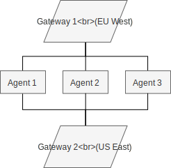

# Holo Router

## Gateway

Gateway is a TLS peek-and-splice proxy that dispatches unaltered TCP traffic by
SNI that is resolved by replacing `.holohost.net` suffix with
`.internal-holohost.net`.

[dnscrypt-proxy]: https://github.com/DNSCrypt/dnscrypt-proxy
[letsencrypt]: https://letsencrypt.org
[wikipedia-sni]: https://en.wikipedia.org/wiki/Server_Name_Indication

## Peer Manager

